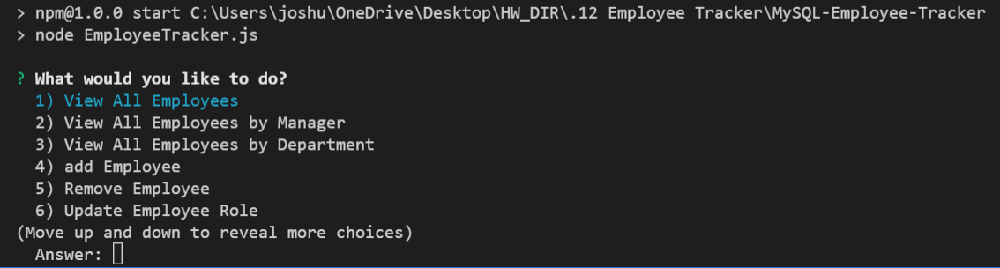

# Unit 12 MySQL Homework: Employee Tracker

Developers are often tasked with creating interfaces that make it easy for non-developers to view and interact with information stored in databases. Often these interfaces are known as **C**ontent **M**anagement **S**ystems. In this homework assignment, your challenge is to architect and build a solution for managing a company's employees using node, inquirer, and MySQL.

## Description

This command-line application can help manage the employees of a company. Node, inquirer and MySQL are used.

## Link to video demonstration

https://youtu.be/WJfe0F3aCkE

## Screenshot

